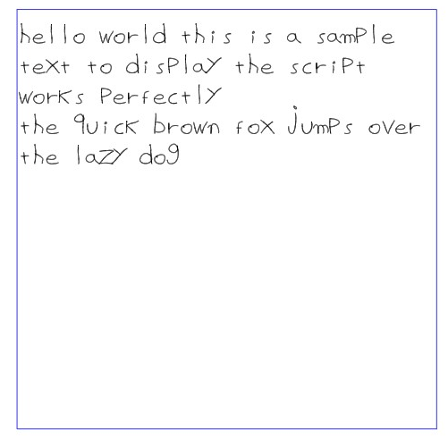

# Blot writer

preview it here:
https://blot.hackclub.com/editor?shareId=48af8909-89fc-48a8-9f0d-87a7fc46a011

Create your own font in inkscape!

I made my font with inkscape, setting the document size to 5x10 mm and writting the characters I wanted to draw, then I exported the SVG of each character and copied the polylines to the font object

